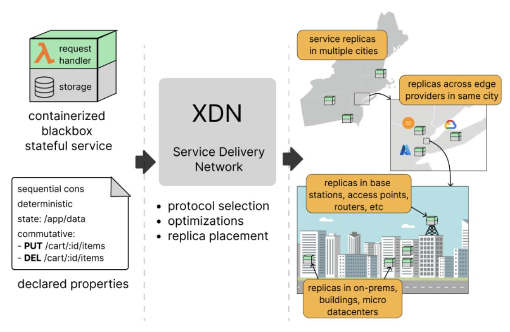

# XDN: Replicating Stateful Service at the Edge

## What is XDN?

{: style="height:150px;width:150px" align=right}

!!! tip "XDN is a research prototype to upgrade CDN"
    XDN aims to _distribute_ and _replicate_ stateful services at the network edge for lower
    latency and better availability. XDN is a major upgrade from the existing CDN technology that only supports static
    content (the C in CDN). The X in XDN represents any services, either stateless or stateful.

CDN was developed for the early Internet, often called Web 1.0, when most websites primarily serve static contents.
Today’s modern web applications are dynamic and interactive, requiring stateful interactions that CDNs were not
designed to handle efficiently.

XDN is being developed for replicating and distributing stateful web services at the network edge.
There are four main design goals to make XDN as effective as, or better than, existing CDN:

- **XDN needs to handle blackbox service** without knowing much of the service's implementation details. That means,
  the containerized stateful service can be written in any language (e.g., Go, Python, C++, etc) and can use any
  persistence datastore (e.g., MySQL, PostgreSQL, MongoDB, ordinary files).
- **XDN needs to offer flexible consistency**, allowing the web service developers to specify the consistency model for
  their replicated web service. We currently support 9 models: `LINEARIZABLE`, `SEQUENTIAL`,
  `CAUSAL`, `EVENTUAL`, `PRAM` or `FIFO`, `READ_YOUR_WRITES`, `MONOTONIC_READS`, `MONOTONIC_WRITES`,
  `WRITES_FOLLOW_READS`. Additionally, XDN provides an API for brave developers to create custom
  coordination/replication protocol, though we warn you that implementing correct distributed protocols is hard 😁.
- **XDN needs to have minimal overhead** beyond replication. While custom-built web services with tightly-coupled 
  replication protocols may perform better than XDN's general approach, the performance gap should be minimal.
- **XDN needs to support amoebic placement** by putting the replicas closer to user demands, ensuring low latency
  similar to CDN while maintaining the requested consistency guarantees.

{: style="height:400px;"}

Check out [our getting started page](1-getting-started.md) to know how to deploy a blackbox stateful service on XDN.

## Getting started

- Start by replicating a service: [deploying a bookcatalog service](1-getting-started.md).
- Consider other consistency models: [predifined models](3-flexible-consistency.md#predefined-consistency-models) or create [custom protocols](3-flexible-consistency.md#custom-replication-protocol).
- Specifying _what_ you have and want, _not how_ to achieve it: [declarative replication](5-service-properties.md).

## Research summary
**Problem.** 
Existing CDN technology can only distribute static contents or stateless services at the network edge, CDN cannot
replicate stateful services. That is problematic because modern websites commonly are stateful, they are dynamic and
interactive, requiring state management. It would be nice if developers could replicate their user-facing stateful
service at the edge, without any modification, the same as CDN which generally does not require modifying the
distributed content.

**Hypothesis.** 
We can have an efficient edge replication platform for blackbox stateful services by _only knowing_ (1) the service and
its operation properties, (2) the requested consistency model, and (3) where the persistent state is written on the
disk.

**Results.** 
Indeed, we can efficiently replicate and distribute blackbox stateful service at the edge!
We built XDN, with the following properties: 
(1) able to handle blackbox, 
(2) offers flexible consistency, 
(3) has low overhead, 
(4) offers amoebic placement.
Achieving those properties requiring us to design a specification language to capture the service and its operations'
properties. XDN also needs to transparently capture the written state on disk, which it does using FUSE,
to handle blackbox service and provide efficient replica movement with low overhead. 

## Limitations

- XDN only supports stateful service that persists its state on disk, an alternative design requires app developer to
  implement their own snapshot mechanism, a non-blackbox approach.
- The current implementation only considers stateful web service with an HTTP interface (i.e., RESTful web service).
- Static and only one consistency model per web service.
